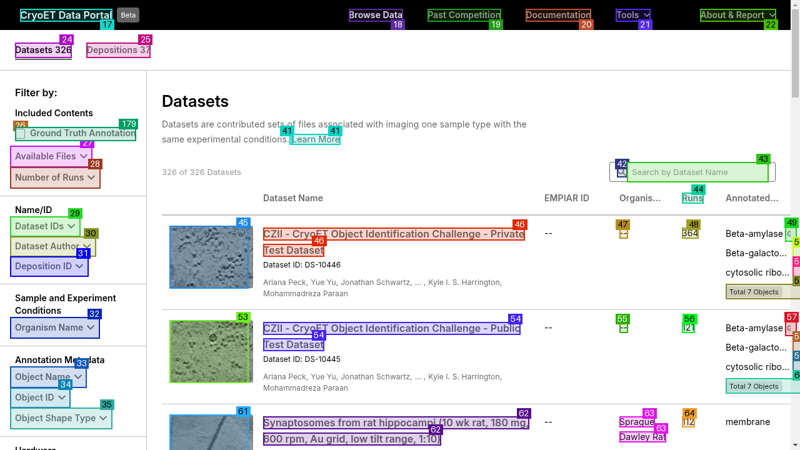
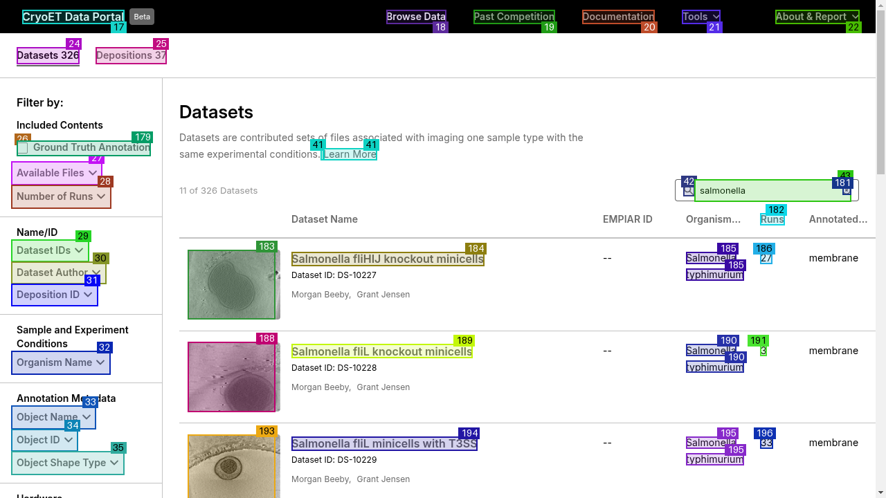

# Cryo ET Tomogram Dataset Search with Camel's OWL framework.
Searching a Cryogenic Electron tomogram dataset of cellular proteins and other organisms, with the help of thecamel-ai's OWL (Optimized Workforce Learning) framework, with native browser interaction.

## CryoET Tomogram Search

An AI-powered tool for searching and analyzing protein tomograms from the CZI CryoET Data Portal using CAMEL-AI's OWL framework.

--- Browsing Images



## Sample Testing
Running a sample script is relatively straightforward : 

## Activating Environment 
Set up your virtual environment with the conda-forge channels using a package manager such as mamba.

```bash
mamba create -n owl_env python=3.12
mamba activate owl_env
```

## Setting up Environment Variables
Currently only Gemini and Groq platforms are only supported.

```bash
export GEMINI_API_KEY={your_key}
export GROQ_API_KEY={your_key}
export OPENAI_API_BASE_URL={https://api.groq.com/openai/v1}
```

## Installation
```bash
pip install -r requirements.txt
playwright install
```

## Usage : 
```python
python run.py "salmonella"
```

Features

--  Web-based search of CryoET Data Portal
--  Automated tomogram analysis
--  Data export capabilities


